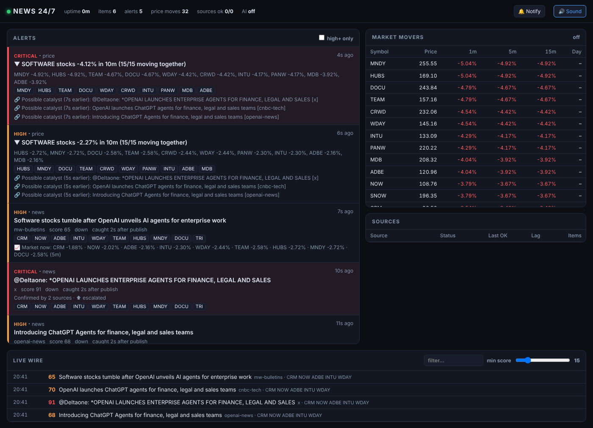
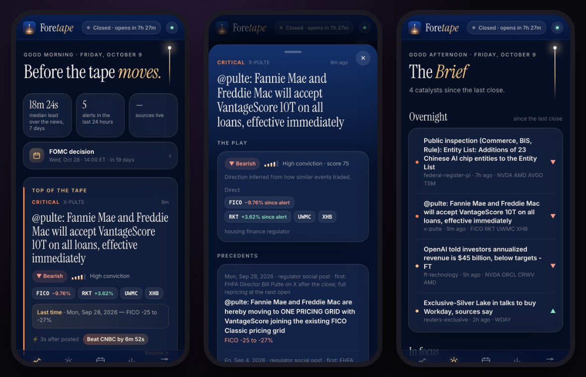

# News 24/7: a market-moving news monitor

News247 runs around the clock and pings your phone within seconds when something breaks that is likely to move stocks. Examples: OpenAI launching an enterprise agent that hits software stocks, an 8-K bankruptcy filing, a "news pending" trading halt, a Fed statement, a tariff post, or a whole sector suddenly dropping 3%.

It watches about 85 sources at once. **First come the places where 2026's market-moving stories actually appeared first** ([research](docs/research/first-sources-2026.md)):
- Federal Register public inspection, OFAC, BIS and USTR
- Supreme Court and federal court opinions
- SEC 8-Ks, 13D/13Gs and tender offers
- FHFA, CENTCOM, the Fed, BLS and Truth Social
- AI leaders' own blogs
- Polymarket odds jumps

Then come AI-lab and big-tech newsrooms, newspaper scoop feeds (FT, Bloomberg, Axios, NYT, The Information), headline squawks, exchange halts, press-release wires, Asian newsrooms and Bluesky in real time, plus optional push feeds (X, Alpaca/Benzinga).

It also watches **prices**: if software stocks fall together it tells you so, and names the headline that most likely caused it.

Alerts arrive as **push notifications from Foretape**, News247's own home-screen app (free, no phone number or account needed). They can also go to **WhatsApp**, **iMessage** from your own Mac relay, ntfy, Telegram, Discord, Slack, Pushover, email or SMS.



```
🔴 CRITICAL  @DeItaone: *OPENAI LAUNCHES ENTERPRISE AGENTS FOR FINANCE, LEGAL AND SALES
    x (primary) · published 3s ago, caught 2s after publish
    Watch: CRM NOW ADBE INTU WDAY TEAM HUBS MNDY DOCU TRI  ▼ down
    Themes: ai lab launch, ai disrupts software
    Confirmed by 2 sources · ⬆ escalated

🔴 CRITICAL  ▼ SOFTWARE stocks -4.12% in 10m (15/15 moving together)
    MNDY -4.92%, HUBS -4.92%, TEAM -4.67%, DOCU -4.67%, WDAY -4.42% …
    Possible catalyst (7s earlier): @DeItaone: *OPENAI LAUNCHES ENTERPRISE AGENTS … [x]
    Possible catalyst (7s earlier): Introducing ChatGPT Agents for finance, legal and sales teams [openai-news]
```

---

## Quick start: alerts on your phone, running 24/7

### Option A: Foretape, the home-screen app with push alerts (recommended, 100% free)

**→ [docs/FORETAPE.md](docs/FORETAPE.md) (about 10 minutes, once).**

1. Click **[Deploy to Render](https://render.com/deploy?repo=https://github.com/adhabnr-ux/News-24-7)** (Free plan, no card). News247 pings itself so the free plan never sleeps.
2. On your iPhone, open `https://<your-app>.onrender.com/app/?token=<DASHBOARD_TOKEN>` in Safari, then **Share → Add to Home Screen**.
3. Open **Foretape** from the home screen and tap **Turn on alerts**. A test notification arrives in about a second.

Alerts land on your lock screen the moment News247 scores a story HIGH or CRITICAL; critical ones stay on screen until you tap them.

Every alert comes with an analysis:
- **The play:** bullish or bearish, a conviction meter, the direct tickers and the read-through names.
- **Precedents:** the most similar past events and how they traded (*"Last time (Sep 28, 2026): FICO −25 to −27%"*).
- **The tape since:** each ticker's move since the alert.
- **Your edge:** *"Beat CNBC by 6m 52s"*, measured live.

There's also a **morning Brief** pushed at 08:15 ET on market days, a **catalyst calendar** (FOMC, jobs, elections, option expiries, holidays) and a live **board** of movers.

It needs no phone number, no Meta/Apple developer account and no app store. It uses standard Web Push (encrypted; iOS 16.4+, Android, desktop). Optional: a free Postgres in `STATE_DB` keeps phones subscribed across Render restarts.



### Option A1: 100% free, alerts on WhatsApp through Meta's test number

**→ Follow [docs/FREE-SETUP.md](docs/FREE-SETUP.md) (about 30 minutes, once, no coding, no credit card).**

In short:
1. On developers.facebook.com, create an app with **WhatsApp**. Meta gives you a free test number. Add your WhatsApp number as a recipient and copy the IDs and a permanent token.
2. Click **[Deploy to Render](https://render.com/deploy?repo=https://github.com/adhabnr-ux/News-24-7)** (Free plan). Paste your number and the Meta values. News247 pings itself so the free plan never sleeps.
3. Paste the webhook URL and token from the Setup page into Meta, then press **Send test message**.

Inside Meta's 24-hour window you get full alerts. Outside it you get a short alert with a **Show details** button, and one tap brings everything in full. Reply `PAUSE 2h`, `STOP`, `RESUME`, `CRITICAL`, `NORMAL` or `STATUS` to control it.

### Option A2: your own "CallMeBot" on WhatsApp, also 100% free

The server becomes a linked WhatsApp device of a spare number, so you get full messages any time with no Meta app, no templates and no 24-hour rule. The pairing is backed up to a free Postgres, so Render's free plan works: [docs/OWN-CALLMEBOT.md](docs/OWN-CALLMEBOT.md).

### Option A3: iMessage from your own Mac relay

The monitor runs in the cloud, and any Mac signed in to Messages sends the iMessages: [docs/SETUP-CLOUD-IMESSAGE.md](docs/SETUP-CLOUD-IMESSAGE.md).

Why a Mac at all? Apple has no public iMessage API. Every iMessage must leave an Apple device, and services like Sendblue are racks of Macs. The relay is that same idea with your own Mac, built into News247: authenticated, queued, with delivery receipts and failover. Details and hardware options are in [docs/IMESSAGE-RELAY.md](docs/IMESSAGE-RELAY.md).

### Option B: on a Mac that stays on (free, real iMessage)

```bash
git clone https://github.com/adhabnr-ux/News-24-7.git && cd News-24-7
./deploy/install-macos.sh
```
The installer asks for your phone number, keeps the Mac awake, starts at login, and sends a test iMessage. macOS asks once whether Terminal may control Messages: click **OK**. **Tip:** sign Messages on that Mac into a separate "bot" Apple ID so alerts arrive as normal incoming iMessages with notification sounds.

To see the whole pipeline before setting anything up, run `news247 demo` (simulated "OpenAI launch → software selloff").

### All ways to reach your phone

| Option | Bubble | Cost | Setup |
|---|---|---|---|
| **Foretape app** (built in) | lock-screen push notification | **free** | Open `/app/?token=…` on your phone, add it to the home screen, tap **Turn on alerts**. On by default (`WEBPUSH_ENABLED`). See [docs/FORETAPE.md](docs/FORETAPE.md). |
| **WhatsApp, self-hosted** (built in) | WhatsApp | free (+ a second number for the sender, recommended) | Runs inside the monitor as a linked device. `WHATSAPP_ENABLED=true`, `WHATSAPP_TO`, then scan the QR on the Setup page. Receipts, commands, auto-reconnect. Unofficial client, so see the risk note in [docs/WHATSAPP.md](docs/WHATSAPP.md). |
| **WhatsApp Cloud API** (Meta, official) | WhatsApp | **free** with Meta's test number | `WHATSAPP_CLOUD_ENABLED`, `WHATSAPP_CLOUD_TOKEN`, `WHATSAPP_CLOUD_PHONE_ID`, `WHATSAPP_CLOUD_WABA_ID`, `WHATSAPP_TO`. Creates its own template, handles the 24-hour window, takes replies through a webhook: [docs/FREE-SETUP.md](docs/FREE-SETUP.md). |
| **News247 relay** (built in) | blue (iMessage) | free (needs a Mac signed in to Messages) | Monitor runs anywhere. `RELAY_ENABLED=true`, `IMESSAGE_TO`, then the one-line Mac install from the Setup page. Delivery receipts, failover, text commands. See [docs/IMESSAGE-RELAY.md](docs/IMESSAGE-RELAY.md). |
| **BlueBubbles** relay | blue (iMessage) | free | Monitor runs anywhere (VPS, Linux, Docker); a Mac at home runs the free [BlueBubbles](https://bluebubbles.app) server. Set `BLUEBUBBLES_ENABLED`, `BLUEBUBBLES_URL`, `BLUEBUBBLES_PASSWORD`, `IMESSAGE_TO`. |
| **Sendblue** | blue (iMessage) | free sandbox (10 contacts); paid from ~$29/mo | No Mac at all. Text your Sendblue number once from your phone, then set `SENDBLUE_ENABLED`, `SENDBLUE_API_KEY_ID`, `SENDBLUE_API_SECRET`, `SENDBLUE_FROM`, `IMESSAGE_TO`. |
| **Blooio** | blue (iMessage) | from ~$39/mo | No Mac. `BLOOIO_ENABLED`, `BLOOIO_API_KEY`, `IMESSAGE_TO`. |
| **Textbelt** | green (SMS) | prepaid, ~a few cents/text | No registration paperwork. Links are stripped (Textbelt holds link texts until your account is verified). `TEXTBELT_ENABLED`, `TEXTBELT_KEY`, `SMS_TO`. |
| **Twilio** | green (SMS) | ~$1/mo + ~1¢/text | US carriers require A2P 10DLC or toll-free verification first (≈$45 and 1–3 weeks for a sole proprietor). |
| **ntfy** app | push notification | free | Install **ntfy**, subscribe to a secret topic, set `NTFY_ENABLED=true`, `NTFY_TOPIC`. With `NTFY_BACKUP=true` it only fires when iMessage couldn't be sent (e.g. the relay Mac is asleep). |
| Telegram / Discord / Slack / Pushover / e-mail / webhook | | free | See `config.example.yaml`. |

All of these are switched on from `.env` (see `news247 init`). Check any channel with `news247 test-notify --only imessage` (or `relay`, `ntfy`, …). Any channel can be a **backup** (`backup: true`): it fires only when every primary phone channel failed for that alert.

Each channel has a `min_severity`. By default your phone gets **HIGH + CRITICAL**, the console also shows **MEDIUM**, and quiet hours (e.g. 23:30–06:30) let only **CRITICAL** through.

### Manual install (Linux, Windows, Docker)

```bash
python3 -m venv .venv && source .venv/bin/activate      # Windows: .venv\Scripts\activate
pip install -e .
news247 init        # writes config.yaml + .env; fill in .env
news247 check       # tests every source from YOUR network and shows what works
news247 run         # start monitoring; dashboard at http://localhost:8247
```

---

## How fast is it?

### Lesson from 2026-10-08: the OpenAI news that moved stocks wasn't an OpenAI post

Around 1 pm ET on 2026-10-08, the **Financial Times** reported that OpenAI had told investors its annualized revenue was about **$50B**, against the ~$70B investors had assumed. Bloomberg relayed it at 1:04 pm, and squawk accounts posted it within seconds. The Nasdaq-100 fell more than 300 points in about 30 minutes: NVDA −3%, ORCL −6%, CRWV −8%, AMD and AVGO −5%. Yahoo and Google News had the story **30+ minutes later**, after the move.

So News247 watches two lanes:

1. **First-party posts.** The labs' own sites, YouTube, and X accounts. These are **VIP sources**: anything OpenAI or Anthropic publishes is texted to you instantly, whatever it says. It never waits for confirmation or for the AI model.
2. **Scoops.** Newspapers break most market-moving AI news (revenue, funding, chip deals). The fastest ways to catch them are squawk accounts (@DeItaone "Walter Bloomberg", @FirstSquawk, FinancialJuice), the scoop publishers' own feeds (FT, Bloomberg, The Information), and newsdesk wires (Benzinga via Alpaca). The scorer knows that AI-lab money news re-prices the whole AI trade (`ai_lab_financials` → NVDA, ORCL, CRWV, AMD, AVGO, MSFT, SMCI) and that "FT says", "told investors" and "people familiar" mark a scoop.

That exact event is replayed in the test suite (`tests/test_fast_sources.py::test_replay_openai_revenue_scoop`): the squawk is texted on arrival, the Bloomberg version a minute later merges into the same story instead of sending a second text, and the selloff alert names the scoop as the cause.

### Sources by speed

| Source | How | Typical time to your phone | Cost |
|---|---|---|---|
| **X stream**: @OpenAI, @sama, @AnthropicAI… (VIP) + @DeItaone, @FirstSquawk, @financialjuice… | **push** (official filtered stream) | ~2–5 s | pay-per-use, ~$0.005/post (~$10–60/mo depending on accounts) |
| **First places** (2026 research): Federal Register public inspection, OFAC, BIS/USTR, SCOTUS/CAFC/PACER opinions, FHFA, CENTCOM, darioamodei.com, Polymarket odds jumps | poll every 30–60 s, **2–5 s bursts** at release times (08:45/11:15/16:15 ET filings, 10:00 ET opinions) | ~5–60 s | free |
| **Alpaca news** (Benzinga newsdesk, tickers attached) | **push** (websocket) | seconds–2 min | free (paper-trading keys) |
| Bluesky newsrooms (Reuters, AP, WSJ, Bloomberg, NYT…) | **push** (Jetstream) | ~1–2 s after they post | free |
| Telegram squawks (FinancialJuice…) | poll every 5 s | ~5–10 s | free |
| OpenAI news RSS, Anthropic newsroom (VIP) | poll every 10 s | ~10 s + the site's own feed lag | free |
| OpenAI YouTube (livestream announcements, VIP) | poll every 30 s | ~30 s + YouTube feed lag | free |
| FT, Bloomberg Tech, The Information, Axios feeds | poll every 20–30 s | ~20 s + feed lag (usually 1–5 min after the article) | free |
| SEC EDGAR 8-K filings | poll every 10 s | ~10–30 s after EDGAR posts it | free |
| Nasdaq trading halts (all US exchanges) | poll every 15 s | ~15–30 s | free |
| Fed, White House, Treasury, BLS, FDA, ECB… | poll every 15–60 s | ~15–60 s | free |
| Press-release wires, MarketWatch bulletins, CNBC, WSJ | poll every 20–45 s | ~30–90 s | free |
| Prices: Yahoo (free) / Finnhub (free key, push) | poll 15 s / push | ~15–30 s / ~1–3 s | free |
| Hacker News, Google News | poll 30–90 s | minutes (used as confirmation only) | free |

**What "instantly" honestly takes:** the free lanes already beat the aggregators by a wide margin. To be told within seconds of a scoop or an executive's post, enable the **X stream** (the single biggest upgrade) and the free **Alpaca** news stream. The installer asks for both, or you can set them in `.env` later. True sub-second institutional feeds (Bloomberg Terminal, Dow Jones/LSEG direct, Truth Social's official API) cost $25k–$100k+ a year and are out of scope.

Built-in safeguards: polling uses conditional GETs, so checking every 5–10 s costs almost nothing. Squawk relays and publisher copies of the same story are merged into one text. Posts from a VIP account that look like a crypto/airdrop scam (OpenAI's newsroom account was hijacked in 2024) do not get the instant treatment.

`news247 stats` shows, for your own machine, each source's publish→detect lag and **which source had each story first**, so you can see which feeds are worth keeping.

---

## How it decides what matters

> **Research-backed.** The criteria come from a study of 186 real market-moving events (2016 to Oct 2026, including 54 from Jun–Oct 2026 traced to where each broke first and 33 small caps that moved 25–3,000% on one headline) and the headline that first reported each one. `news247 backtest` replays them: **96% are caught from the first report, with 0 false alarms on 122 "sounds big but isn't" headlines.** Full write-up: [docs/WHAT-MOVES-MARKETS.md](docs/WHAT-MOVES-MARKETS.md). Where the news comes from (Bloomberg vs. social media, and what each costs): [docs/WHERE-THE-NEWS-COMES-FROM.md](docs/WHERE-THE-NEWS-COMES-FROM.md).

Every item is scored from 0 to 100 by a deterministic rule engine. It takes about 50 µs per item, never goes down, and every score can be explained:

- **Source tier**: primary (the company/regulator itself) > wire > media > social
- **Event keywords**: bankruptcy, to acquire, cuts guidance, FDA rejects, export ban, rate cut, tariff, halt, …. The best match counts fully, the next ones count less.
- **Themes**, i.e. multi-condition patterns that encode how markets react:
  - `ai_disrupts_software`: an AI lab *launches* an *agent/plugin for legal/finance/sales/coding/…* → CRM, NOW, ADBE, INTU, WDAY… **down**
  - `ai_compute_deal`: a giant data-center or GPU deal → NVDA, AMD, AVGO, ORCL, VRT… **up**
  - `cheap_frontier_model`: a DeepSeek-style cheap model → NVDA, AVGO, TSM… **down**
  - `ai_lab_financials`: OpenAI/Anthropic/xAI revenue, valuation, funding or spending news → NVDA, ORCL, CRWV, AMD, AVGO, MSFT… (the 2026-10-08 selloff)
  - also `chip_export_controls`, `fed_policy`, `trade_war`, `macro_print`, `bigtech_antitrust`, `crypto_policy`, `geopolitical_shock`, `ai_disrupts_search`, `ai_lab_launch`
- **Companies**: 80+ companies and macro actors with aliases. Private AI labs map to the public stocks *exposed* to them (OpenAI → MSFT, NVDA, ORCL, AMD, AVGO, CRWV). A post on OpenAI's own blog counts as an OpenAI announcement even if the headline is just "Introducing X".
- **Penalties**: law-firm class-action spam, "stocks to buy", "here's why", event schedules, podcasts, question headlines
- **Confirmation**: the same story from several outlets is clustered into **one** alert. Each extra source raises the score, and an alert re-fires only when the story *escalates* to a higher severity.
- **Signals from the source itself**: 8-K item codes (1.03 bankruptcy, 4.02 restatement…), halt reason codes (T1 news pending, MWC circuit breaker)

- **Small and mid caps, sized against the company**: every listed company's market cap is known, so a $45M Army contract for a $70M drone maker, a buyout at a 100% premium or an FDA letter for a one-drug biotech is scored by the move it means *for that company* (see below)

Severity: **CRITICAL ≥ 75**, **HIGH ≥ 55**, **MEDIUM ≥ 35** (all configurable).

Tune it with `news247 score`:

```text
$ news247 score "Introducing GPT-6" --tier primary --entity OpenAI

  🟠 HIGH  score 62.0/100   direction: unknown
  tickers:  MSFT NVDA ORCL AMD AVGO CRWV
  entities: OpenAI
  themes:   ai_lab_launch

    +20 primary source
    +18 keyword 'gpt-6*'
    +4 keyword 'introduc*'
    +5 known entity (OpenAI)
    +15 theme ai_lab_launch
```

### Optional: local AI second opinion (Ollama)

```bash
# install from https://ollama.com, then
ollama pull qwen2.5:7b-instruct
```

```yaml
llm:
  enabled: true
  model: qwen2.5:7b-instruct
```

Items the rules find at least somewhat interesting are sent to your local model. It rates impact from 0 to 10, names the affected tickers, and writes a one-line "why it matters" that appears in the alert. Design choices:

- **CRITICAL alerts never wait for the model.** HIGH alerts wait at most `budget_ms` (2.5 s). If the model finishes later and raises the severity, you get an escalation.
- The model can only **nudge** the score (−20 / +25), so a confused model cannot hide a circuit breaker.
- The model is kept loaded in memory (`keep_alive`) to avoid cold-start delays.
- Any OpenAI-compatible server works too (LM Studio, llama.cpp, vLLM): `provider: openai`.

---

## The little things: small caps that move big

Big stocks are half the game. The other half is the $200M company whose FDA approval, buyout or
government stake sends it +60% to +300% before most people have heard of it. News247 knows the
market cap of every listed US stock (Nasdaq's free screener, cached daily) and reads each
headline the way a small-cap trader does:

- **Sized against the company**: contract or deal value ÷ market cap, the buyout premium vs. the
  last price, binary FDA and trial outcomes for small biotechs, NVIDIA/OpenAI/hyperscaler deals
  and stakes, US government equity stakes, crypto-treasury PIPEs, short reports, offerings.
  A catalyst worth +25% or more for that company is pushed to your phone.
- **Pump-and-dump guards**: under $30M, under $1, recent China/HK micro-cap IPOs and fluff
  ("joins NVIDIA Inception") are shown but never boosted.
- **The radar**: every minute from 04:00 to 20:00 ET it scans the whole market, pre- and
  after-hours included, with thresholds scaled to size (±20% for a micro cap, ±6% for a $75B
  company, ±4% for a mega cap). It flags breakouts **before any headline**, then tells you when the
  news lands that the radar had it first. Post-mortem that shaped it:
  [docs/research/mrna-2026-10-09.md](docs/research/mrna-2026-10-09.md).
- **Earlier than the news**: readout, PDUFA and FDA-panel dates announced weeks ahead go on the
  Calendar automatically ("Tomorrow 08:30 ET: KOD · Phase 3 trial readout" in the morning Brief), and
  NVIDIA/Alphabet/Amazon/Berkshire 13F filings are read the hour they're filed, flagging new stakes
  and exits in small caps (SoundHound: +67% on NVIDIA's stake, −28% on its exit).
- **In Foretape**: a gold SMALL CAP pill with the catalyst and typical move, an All / Small caps
  tape switch, and a live small-cap radar board on the Watch tab.

```text
$ news247 score --tier wire 'Dronez Systems (NASDAQ: DRNZ) Awarded $45 Million U.S. Army Contract'
  🟠 HIGH  score 70.0/100   direction: up
  small cap: DRNZ $70M micro cap · Contract from U.S. Army worth 64% of market cap · +36–96% typical
```

Backtest: 32 of 33 small-cap events (2024 to Oct 2026) caught from the first report, 0 of 16
small-cap noise releases flagged. Full guide: [docs/SMALLCAPS.md](docs/SMALLCAPS.md).

---

## Price-move detection: "all the stocks are crashing"

- **Single stocks**: ±1.5 % in 1 min, ±3 % in 5 min, ±5 % in 15 min (index ETFs have tighter built-in limits, e.g. SPY ±0.8 % in 5 min). Also one alert per day for a ±7 % move from the previous close.
- **Sector baskets**: software, semis, megacap, ai_infra, crypto and index. An alert fires when the *average* move crosses the threshold **and** enough members move together, so one stock crashing doesn't count as a sector move.
- **Coalescing**: if 15 software stocks drop at once you get **one** alert, not 15.
- **Correlation**: every price alert lists the recent headlines (within 45 min) that mention the stocks that moved: *"Possible catalyst (2m earlier): …"*. News alerts show the current move of the affected tickers.
- Cooldowns stop repeat alerts. A move that becomes 1.5× worse alerts again.

Data: **Yahoo** (free, polled, includes pre/after-hours) or **Finnhub** (free key, real-time websocket for about 50 symbols).

---

## Run it 24/7

It needs a machine that stays on: a small cloud VPS ($4–6/month), a Raspberry Pi, a home server, or a desktop that doesn't sleep.

**Docker** (recommended):
```bash
news247 init               # or copy news247/data/config.example.yaml to config.yaml
docker compose up -d       # restarts automatically; dashboard on http://localhost:8247
docker compose logs -f
# with a local LLM:
docker compose --profile ai up -d && docker compose exec ollama ollama pull qwen2.5:7b-instruct
#   and set llm.base_url: http://ollama:11434
```

**macOS**: `./deploy/install-macos.sh` (see Quick start; `--uninstall` removes it). **Linux (systemd)**: `deploy/news247.service`. **Windows**: `deploy/windows-task.ps1`. Each file has install instructions at the top.

Built in to keep it running:
- Every source runs independently. A failing source backs off exponentially, honours `Retry-After`, and never affects the others.
- Websockets reconnect automatically and resume from the last cursor.
- Seen items are kept in SQLite, so a restart never re-sends alerts. On startup, only items published in the last 5 minutes are pushed; older ones go to the dashboard only.
- If **no** source has succeeded for 5 minutes (e.g. the internet is down), you get one alert, and another when it recovers.
- `/health` endpoint, Docker healthcheck, rotating log in `data/news247.log`.
- To open the dashboard from your phone on your LAN: `web.host: 0.0.0.0` **plus** `web.token`.

---

## Optional upgrades

| Upgrade | What you gain | How |
|---|---|---|
| **X stream** | First-party posts (OpenAI, sama, Anthropic, Google DeepMind, xAI, Nvidia…) and squawk relays of FT/WSJ/Bloomberg scoops within seconds | Token at developer.x.com (pay-per-use). In `.env`: `X_BEARER_TOKEN=…`, `X_STREAM_ENABLED=true`. Edit the accounts under `x-stream` in config. |
| **Alpaca news** (free) | Benzinga newsdesk headlines pushed in real time, with tickers | Free account at app.alpaca.markets → API keys. `ALPACA_KEY`, `ALPACA_SECRET`, `ALPACA_ENABLED=true`. |
| **Finnhub** (free key) | Real-time trades instead of 15-s price polling | `market.provider: finnhub`, `FINNHUB_TOKEN` |
| **Truth Social** | Presidential posts that move tariffs/markets | Cloudflare blocks datacenter IPs: run from home and enable `truth-social`, or rely on the `trump-truth-mirror` feed (third-party; confirm with `news247 check`) |
| **Reddit** | WSB/stocks chatter (free OAuth "script" app) | `reddit` source + `REDDIT_CLIENT_ID/SECRET` |
| **Local AI** (Ollama) | A one-line "why it matters" in each text, and a second opinion on borderline items | See [Optional: local AI second opinion](#optional-local-ai-second-opinion-ollama) |

Add any other site in two lines:

```yaml
sources:
  - {name: my-feed, type: rss, url: "https://example.com/feed.xml", tier: media, interval: 30}
  - {name: xai-newsroom, type: pagewatch, url: "https://x.ai/news", link_pattern: 'x\.ai/news/[a-z0-9-]+$', entities: [xAI]}
```

`pagewatch` monitors any page that has no RSS feed. It reports each new link that matches the pattern as a new post (the built-in Anthropic and Treasury sources use it).

---

## Configuration

Everything lives in `config.yaml` (from `news247 init`). Every option is documented in [`news247/data/config.example.yaml`](news247/data/config.example.yaml). The main sections:

- `scoring`: thresholds, your `watchlist`, extra `keywords` / `companies` / `themes`, `mute` patterns
- `market`: provider, symbols, move `rules`, per-symbol `overrides`, sector `groups`
- `sources`: override built-ins by name (`enabled: false`, `interval: 10`, …) or add new ones. The built-ins are in [`news247/data/default_sources.yaml`](news247/data/default_sources.yaml).
- `notify`: channels, `min_severity` per channel, `quiet_hours`, `rate_limit_per_minute`
- `llm`, `web`, `general`

Secrets go in `.env` and are referenced from the config as `${NAME}`.

### Commands

| Command | What it does |
|---|---|
| `news247 run` | Start monitoring (`--no-web`, `--no-market`, `--port`, `--host`) |
| `news247 check [names…]` | Fetch every source once from this machine; shows status, newest item and errors |
| `news247 score "headline"` | Explain a score (`--tier primary --entity OpenAI --ticker ACMB --summary …`) |
| `news247 universe [--refresh] [SYM…]` | Load every listed company's market cap; look companies up |
| `news247 test-notify [--only imessage]` | Send a test alert through every enabled channel (or just one) |
| `news247 demo` | Simulated "AI launch → software selloff" through the real pipeline, dashboard and notifications |
| `news247 stats` | Measured detection latency per source, and which source had each story first |
| `news247 backtest [-v]` | Replay 186 historical market-moving events and 122 noise headlines through the scoring rules |
| `news247 init` | Write a starter `config.yaml` + `.env` |

### API

`GET /api/alerts`, `/api/items?min_score=50`, `/api/market`, `/api/radar`, `/api/status`, `/api/latency`, `/health`, and `GET /events` (Server-Sent Events stream of `item` / `alert` / `item_update`).

---

## Architecture

```
 sources (async, independent)                        pipeline                              outputs
 ───────────────────────────                         ────────                              ───────
 push: X stream · Alpaca · Bluesky ───┐
 RSS/Atom · SEC EDGAR · Nasdaq halts ─┤                     VIP floor (labs: instant)
 page watcher · Telegram · HN · Reddit┼─► dedupe ─► score (rules) ─► cluster stories ─┬─► SQLite (history, seen ids)
 Mastodon/Truth Social ───────────────┘   (uid)     tickers/themes   +confirmation    ├─► dashboard (SSE) + JSON API
                                                          │                           └─► alert ─► relay ══WebSocket══► Mac ─► iMessage
                                          optional local LLM (bounded, time-boxed)              (backup: ntfy/SMS/Telegram/
                                                                                                 Discord/Slack/email/webhook)
 Yahoo / Finnhub prices ─► move detector ─► coalesce ─► correlate with recent news ─► price alert
                           (rules, baskets,   (one alert per
                            cooldowns)          sector move)
 Nasdaq screener ─► universe (market caps) ─► small-cap sizing in the scorer
 Yahoo small-cap gainers ─► radar (ladder, volume, pump guards) ─► "moving before the news" alert
```

```
news247/
  sources/      rss, sec_edgar, halts, pagewatch, bluesky, x_stream, alpaca_news, telegram, social (x, mastodon),
                apis (hn, reddit, finnhub)
  analysis/     scorer, smallcap (catalyst sizing vs. market cap), entities, dedup (story clustering), llm
  market/       detector (move rules, baskets), prices (yahoo, finnhub), universe (every listing's size),
                radar (small caps breaking out before the news)
  notify/       channels (relay, iMessage, BlueBubbles, Sendblue, Blooio, SMS, ntfy, Telegram, …) + dispatcher
                (severity routing, quiet hours, pause/text commands, backup channels)
  whatsapp/     WhatsApp: Cloud API client (templates, 24-hour window, webhook) and the self-hosted
                linked device (session supervisor + whatsmeow engine)
  relay/        the iMessage relay: hub (monitor side, queue/digest/failover), agent (Mac side, `news247 relay`),
                signed protocol, Messages app sender, Messages-database receipts, one-line installer
  web/          dashboard + API
  data/         knowledge.yaml (companies, keywords, themes, baskets), default_sources.yaml, config.example.yaml
  engine.py     the pipeline · storage.py SQLite · cli.py
```

## Development

```bash
pip install -e ".[dev]"
pytest -q          # 230 tests: parsers on real feed formats, scoring calibration, move detection,
                   # every notification channel's wire format, LLM client, engine end-to-end, web API,
                   # the iMessage relay over a real WebSocket (auth, queueing, failover, receipts, commands),
                   # WhatsApp pairing/sending/receipts/commands (+ booting the real engine when installed)
ruff check . && ruff format --check .
```

---

*For information only, not financial advice. Respect each source's terms of use and rate limits: the SEC asks for a descriptive User-Agent and at most 10 requests/second, which the HTTP client enforces for you.*
